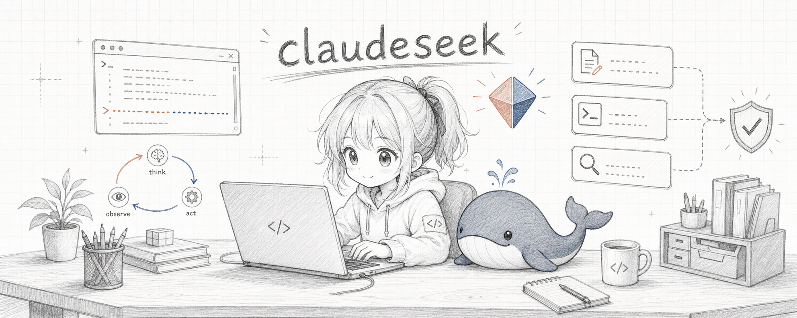

<p align="center">
  
</p>

<p align="center">
  <strong>claudeseek</strong> — a local-first AI coding agent.<br>
  Claude Code's industrial agent architecture, fused with the DeepSeek V4 engine.
</p>

<p align="center">
  <a href="#install">Install</a> ·
  <a href="#cli">CLI</a> ·
  <a href="#web-ui">Web UI</a> ·
  <a href="#providers">Providers</a> ·
  <a href="#architecture">Architecture</a> ·
  <a href="#safety">Safety</a>
</p>

<p align="center">
  
  
  
  
</p>

---

claudeseek is a real coding agent you run on your own machine — not a toy wrapper.
It reads, searches, edits, and runs code through a permission-gated tool loop, the
same shape Claude Code uses, with two faces over one engine:

- a **terminal REPL** with streaming output, slash commands, and inline approvals;
- a **local Web UI** (127.0.0.1, token-gated) with live tool-call cards, an
  approval flow, a context meter, sessions, and a cost panel.

It reads your machine's **DeepSeek** credentials automatically — no key to paste —
and can switch to any **OpenAI-compatible** endpoint (a relay that serves
Claude / GPT) without touching code. Zero runtime dependencies: just Node ≥ 18.

> **Lineage.** The architecture is studied from the publicly-exposed Claude Code
> source (`QueryEngine`, the tool/permission model, context assembly, the
> message-centric sub-agent pattern) and re-implemented from scratch in plain
> ESM JavaScript for the DeepSeek API. It is a sibling to
> [WEIPING_WHALE](https://github.com/appleweiping/WEIPING_WHALE) (the TypeScript
> DeepSeek CLI) — claudeseek adds the Web UI, the composable permission pipeline,
> and multi-provider routing. Not affiliated with Anthropic or DeepSeek.

## Install

```bash
git clone https://github.com/appleweiping/claudeseek.git
cd claudeseek
npm install          # installs nothing — there are no dependencies; just links the bin
npm link             # optional: puts `claudeseek` / `cseek` on your PATH
node bin/claudeseek.js --doctor
```

State lives in `~/.claudeseek/` (sessions, undo snapshots, skills, config,
memory outbox). The CLI exposes two commands: `claudeseek` and `cseek`.

## First run

claudeseek finds your DeepSeek key automatically, in this order:

1. `DEEPSEEK_API_KEY` (environment)
2. `~/.claudeseek/config.json` → `llm.api_key`
3. an existing `~/.deepseek-cli/config.toml` / `~/.weiping-whale/config.toml`
   install (endpoint + key reuse — nothing to re-enter)

```bash
claudeseek                       # interactive REPL
claudeseek -p "summarize this repo's architecture"
claudeseek -m pro --mode plan -p "review auth.js for security gaps"
claudeseek --serve --open        # local Web UI
claudeseek --doctor --json       # diagnostics, machine-readable
claudeseek --last                # resume the most recent session
```

## CLI

The REPL streams the model's thinking and answer, renders each tool call as it
runs, and asks before anything risky.

| Slash command | What it does |
| --- | --- |
| `/model [name]` | show or switch model: `pro`, `flash`, `auto`, `reasoner`, `chat` |
| `/mode [m]` | permission mode: `default`, `acceptEdits`, `bypassPermissions`, `plan` |
| `/cost` | session cost, per-model breakdown, cache-hit ratio |
| `/context` | context-window usage estimate |
| `/compact` | summarize older turns to reclaim context |
| `/undo` | revert the last turn's file changes |
| `/sessions`, `/resume <id>` | list and reopen past sessions |
| `/skills`, `/skill <name>` | discover and inject `SKILL.md` skills |
| `/todos` | show the agent's live task list |
| `/mcp`, `/memory` | MCP server status · agentmemory status |
| `/remember <text>`, `/recall <q>` | write to / search agentmemory |
| `/help`, `/quit` | help · exit (Ctrl+C aborts a running turn) |

`--model auto` runs a zero-cost keyword router per turn: hard signals
(`debug`, `architecture`, `调试`, `根因`) → V4 Pro + max thinking; light ones
(`search`, `format`, `翻译`) → Flash; everything else → Flash + thinking.

## Web UI

```bash
claudeseek --serve --port 3618 --open
```

A single self-contained page bound to `127.0.0.1`, gated by a bearer token
printed once at startup (pin it with `CLAUDESEEK_TOKEN`). It streams turns over
NDJSON and gives you:

- **tool-call cards** that expand to show inputs and full output;
- an **approval flow** — risky calls pop an Allow / Always / Deny card inline;
- a **context meter**, **cost chip**, **todo panel**, and **session sidebar**;
- **markdown + code rendering** with copy buttons, light / dark themes;
- one-click **model / permission-mode** switches, **undo**, and **compact**.

The browser talks only to your local server; the server holds the API key.

## Providers

claudeseek defaults to **DeepSeek** (国产 V4 models). To point it at any
OpenAI-compatible endpoint — for example a relay that serves Claude or GPT —
set one environment variable:

```bash
# DeepSeek (default): uses DEEPSEEK_API_KEY
claudeseek -p "..."

# OpenAI-compatible relay: uses OPENAI_BASE_URL + OPENAI_API_KEY
CLAUDESEEK_PROVIDER=relay claudeseek -m gpt-5.5 -p "..."
```

Under `provider: "deepseek"` the client sends V4 thinking params
(`thinking`, `reasoning_effort`); under `provider: "openai"` it speaks plain
chat-completions so any compatible backend works. Define named providers in
`~/.claudeseek/config.json` → `providers`.

## Safety

Permissions follow Claude Code's layered model — first non-null wins:

1. **hard rules** — broadly destructive shell commands (`rm -rf /`,
   `Remove-Item -Recurse C:\`, fork bombs, disk format) are blocked in **every**
   mode;
2. **mode rules** — `plan` is read-only; `bypassPermissions` auto-allows;
3. **session grants** — "Always allow" remembers a rule for the session;
4. **kind defaults** — reads/search/meta auto-allow; writes ask (auto in
   `acceptEdits` inside the workspace); safe read-only shell prefixes auto-allow;
5. **the approver** — REPL prompt or Web UI card. Headless with no approver
   denies anything that would need one (use `--yolo` to opt out).

This is approval-gating, **not** an OS sandbox. Writes are snapshotted before
mutation so `/undo` can roll a turn back.

## Architecture

```
src/
  api.js          DeepSeek / OpenAI-compatible streaming client (tool-call assembly, retries)
  engine.js       the agent loop — assemble → stream → dispatch tools → loop → persist
  permissions.js  composable allow/deny pipeline (hard → mode → session → kind → ask)
  context.js      system-prompt assembly + project memory (CLAUDESEEK.md / CLAUDE.md / AGENTS.md)
  compact.js      CJK-aware token estimate + model/offline context compaction
  router.js       zero-cost per-turn model router (auto mode)
  tools/          read_file write_file edit_file list_dir glob grep bash fetch_url todo task
  mcp.js          stdio MCP client → tools surface as mcp__<server>__<tool>
  sessions.js     durable JSON sessions (resume by id/prefix, --last)
  undo.js         per-turn file snapshots
  cost.js         live cost + DeepSeek prefix-cache accounting
  memory.js       agentmemory bridge (single source of truth) + offline outbox
  repl.js         terminal UI
  server.js       127.0.0.1 Web UI server (token auth, NDJSON streaming, approvals)
public/index.html  the Web UI (zero-build, single file)
```

Patterns ported from Claude Code: a single streaming agent loop that every
surface consumes; the layered permission decision pipeline; message-centric
sub-agents (results return as `<task-notification>` the parent reads as
context, not RPC); file-state snapshots for undo; and stable per-session system
prompts for prefix-cache efficiency.

## Tests

46 end-to-end checks run fully offline against a mock DeepSeek server — real
HTTP, real streaming, real tool execution:

```bash
npm test            # core + cli + server
npm run test:core   # engine, tools, permissions, undo, compaction
npm run test:server # web server: auth, streaming, approval round-trip
```

## Part of the agent workstation

claudeseek is a first-class member of the local agent family documented in
`D:\devtools\AGENTS.md`. It shares the four-piece kit: **Skills** (`SKILL.md`
discovery), **Memory** (agentmemory at `localhost:3111`, tagged
`agent:claudeseek`, per `AGENT-MEMORY-PROTOCOL.md`), and **Safety** (the
permission pipeline above). Launch it with `claudeseek.cmd`.

## License

MIT © appleweiping
